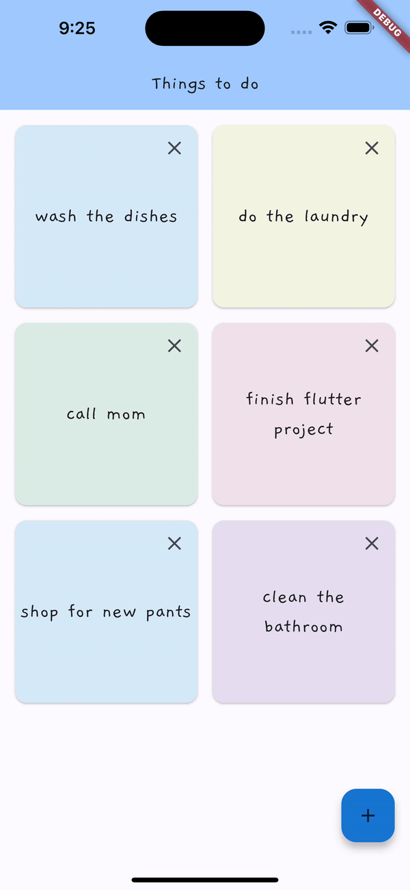

# A simple memo app
[](https://forthebadge.com)

A simple memo app that lets you add short reminders. 

 

# Features

- Add post-it notes. The color of the post-it note is randomly chosen.

  

- Delete post-it note when the task is finished

  

# Installation
1. Install Flutter (preferably, version >= 3.10.2)
2. Clone this repository

    ```bash
    git clone https://github.com/chshin0225/flutter_memo_app.git
    ```

3. Run the project
    ```bash
    flutter run
    ```


